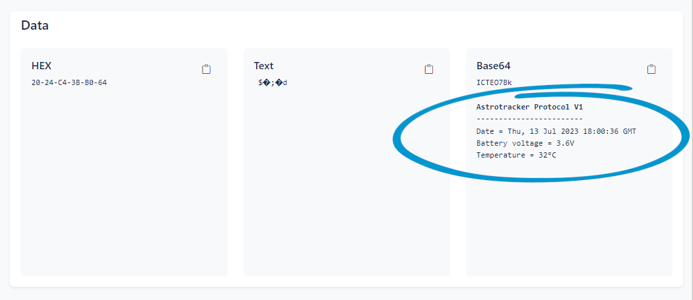
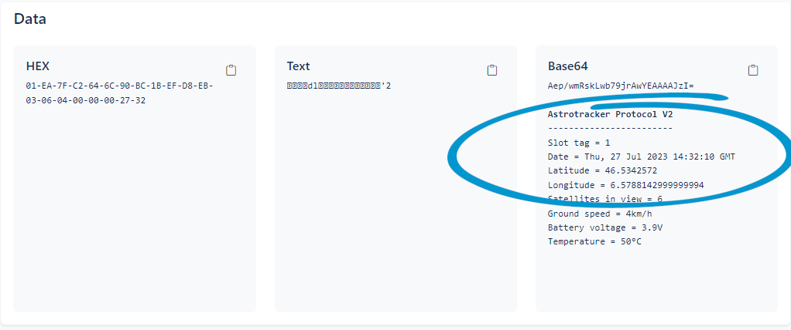

# astrotracker-decoder-chrome-extension
This is a Chrome extension to decode payload sent by Astrotracker devices into Astrocast portal.

## Installation
1. Clone this repository.
2. Open Chrome extensions at chrome://extensions/.
3. Enable developer mode.
4. Click "load unpacked", select extension folder in the cloned repository directory.

## Usage
- The extension will automatically decode Base64 data in Astrocast portal (https://portal.astrocast.com/Message/Details/*).
- The extension will try to decode any payload which is either 6 or 20 bytes long, even if it isn't an Astrotracker device.

## Current decoded protocols

### Astrotracker Protocol V1 (6 bytes)

|Byte offset|Type|Length (Bytes)|Name|Description|
|---|---|---|---|---|
|0|int8|1|Temperature|Temperature of the tracker in deg C (1 deg resolution)|
|1|uint8|1|V Bat|Voltage of the battery in the tracker (multiplied by 10)|
|2|uint32|4|Timestamp|Epoch of the measurement in UNIX time|

### Astrotracker Protocol V2 (20 bytes)

|Byte offset|Type|Length (Bytes)|Name|Description|
|---|---|---|---|---|
|0|uint8_t|1|slot_tag|Message ID|
|1|uint32|4|Timestamp|Epoch of the measurement in UNIX time|
|5|int32|4|Latitude|Degrees Latitude * 1E7 (i.e., latitude multiplied by 10'000'000)|
|9|int32|4|Longitude|Degrees Longitude * 1E7 (i.e., longitude multiplied by 10'000'000)|
|13|uint8|1|SIV|Number of satellites used in fix|
|14|int32_t|4|gSpeed|Ground speed in mm/s|
|18|uint8|1|V Bat|Voltage of the battery in the tracker (multiplied by 10)|
|19|int8|1|Temperature|Temperature of the tracker in deg C (1 deg resolution)|

## Screenshots

### Astrotracker Protocol V1 (6 bytes)

### Astrotracker Protocol V2 (20 bytes)

