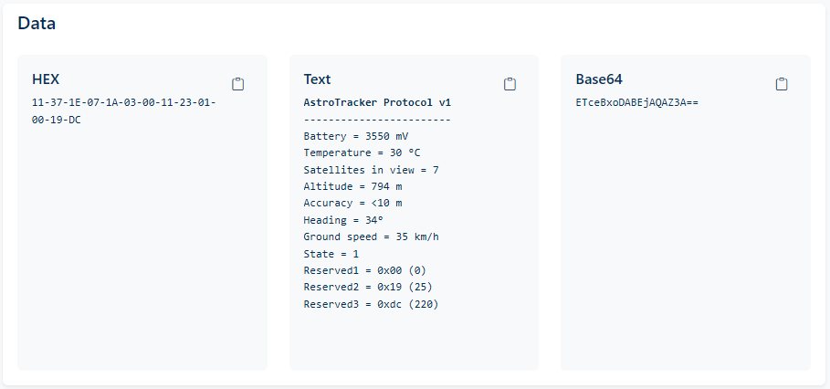

# astrotracker-decoder-chrome-extension

This is a browser extension to decode payload sent by AstroTracker devices into Astrocast portal.

## Installation
1. Clone this repository.

### Chromium-based browsers:
2. Open Chrome extensions at `chrome://extensions`, or your browser's extension manager.
3. Enable `Developer mode`.
4. Click `Load unpacked` and select the `extension` folder of the cloned repository.

### Firefox:
2. Open `Add-ons debugging tool` at `about:debugging#/runtime/this-firefox`.
3. Click `Load Temporary Add-on` and select `manifest.json` file in the extension folder of the cloned repository.
4. Open `Add-on manager` at `about:addons`.
5. Give permissions to AstroTrackerDecoder extension to access your data for sites in the *://portal.astrocast.com domain.

## Usage
- The extension will automatically decode Base64 data in Astrocast portal (https://portal.astrocast.com/Message/Details/*).
- The extension will try to decode any payload which is either 6 or 20 bytes long, even if it isn't an AstroTracker device.

## Current decoded protocols

### AstroTracker Protocol v1 (>=10 bytes)

|Byte offset|Type|Length (Bytes)|Name|Description|Unit|Min|Max|
|-|-----|-|-----------|---------------------------------|----|--|--|
|0|uint8|1|Type       |Type of message                  |    |=0x11|
|1|uint8|1|Battery    |Battery voltage                  |mV  |3000  |5550 |
|2|int8 |1|Temperature|Temperature                      |°C  |-128  |127  |
|3|uint8|1|SIV        |Number of GNSS satellites in view|    |0     |255  |
|4|int16|2|Altitude   |Height above mean sea level      |m   |-32768|32767|
|6|uint8|1|Accuracy   |Accuracy range of the geolocation|m   |<10   |>2550|
|7|uint8|1|Heading    |Heading of motion                |°   |0     |358  |
|8|uint8|1|Speed      |Ground speed                     |km/h|0     |255  |
|9|uint8|1|Switch     |State of status switch           |    |0     |1    |

### Legacy AstroTracker Protocol v0.2 (20 bytes)

|Byte offset|Type|Length (Bytes)|Name|Description|
|---|---|---|---|---|
|0|uint8_t|1|slot_tag|Message ID|
|1|uint32|4|Timestamp|Epoch of the measurement in UNIX time|
|5|int32|4|Latitude|Degrees Latitude * 1E7 (i.e., latitude multiplied by 10'000'000)|
|9|int32|4|Longitude|Degrees Longitude * 1E7 (i.e., longitude multiplied by 10'000'000)|
|13|uint8|1|SIV|Number of satellites used in fix|
|14|int32_t|4|gSpeed|Ground speed in mm/s|
|18|uint8|1|V Bat|Voltage of the battery in the tracker (multiplied by 10)|
|19|int8|1|Temperature|Temperature of the tracker in deg C (1 deg resolution)|

### Legacy AstroTracker Protocol v0.1 (6 bytes)

|Byte offset|Type|Length (Bytes)|Name|Description|
|---|---|---|---|---|
|0|int8|1|Temperature|Temperature of the tracker in deg C (1 deg resolution)|
|1|uint8|1|V Bat|Voltage of the battery in the tracker (multiplied by 10)|
|2|uint32|4|Timestamp|Epoch of the measurement in UNIX time|

